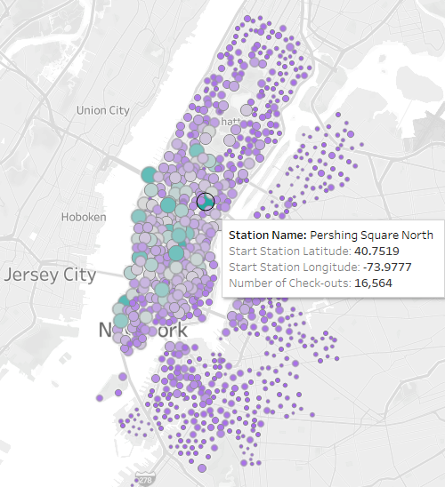
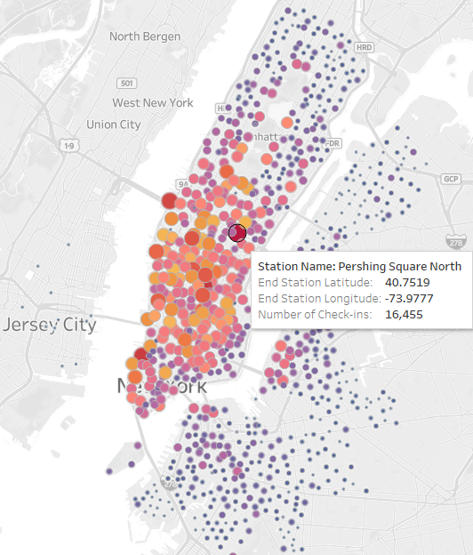

# bikesharing
Module 14

## Overview

This analysis looks at NYC bike sharing data as a baseline for viability of a similar business in Des Moines, Iowa.  

## Results

- There is a spike in checkouts during commuter rush hours.

- Most bikes are checked out for an average of approximately 30 minutes to an hour.

- The hightest number of trips is 5:00-6:00pm on Mondays, Tuesdays and Thursdays.

- Of users that disclosed, males had the hightest usage rate, especially during work day commute hours.

- A large number of males are subscribers and have the highest usage every day of the week compared to females and unknown.

- Subscribers make up the majority of usage with a spike at the morning and evening commute rush hours.

- The highest usage is closer to the city center with one of the highest on Park Ave.

   - Tourist areas may lead to higher usage. 
   
- The top ending locations are also around the city center.  

  - Start areas are slightly more varied then stop locations.
 
       
 
 ## Summary
 
Most usage is from subscribers, a large portion of which are male. The highest rates of usage are during the work week and occur at morning and evening rush hours times.  On average, the checkout duration is between approximately 30 and 60 minutes during peak hours. Weekends are popular days across all gender groups with mid-day being a popular checkout time. Tourist areas may greatly affect the start and stop locations of the bikesharing business. 

### Recommended Additional Analyses

Specific analysis for the Des Moines market may include:
  
  - Population comparison to determine starting bike amount and potential demand. (NYC: 8.38 million, DM: 215,400)
  
  - Analysis of downtown area to determine tourist attractions and potential start and stop locations.
  
  - Determine if bike friendly streets are present in the city.
  
  - Analysis of commuter traffic the potential for subscribers to convert their commute from other transportation.
  
    - Possibly survey community members for an approximate opt in rate.

General analysis may include:

  - What variables affect usage rate?
  
  - Is usage rate per bike a good indication of when service/repair may be needed?

## Check out the story here:
[Link to Tableau Viz](https://public.tableau.com/app/profile/hlea6947/viz/NYC_Citibike_Challenge_16603576932670/NYCCitiBike?publish=yes)
